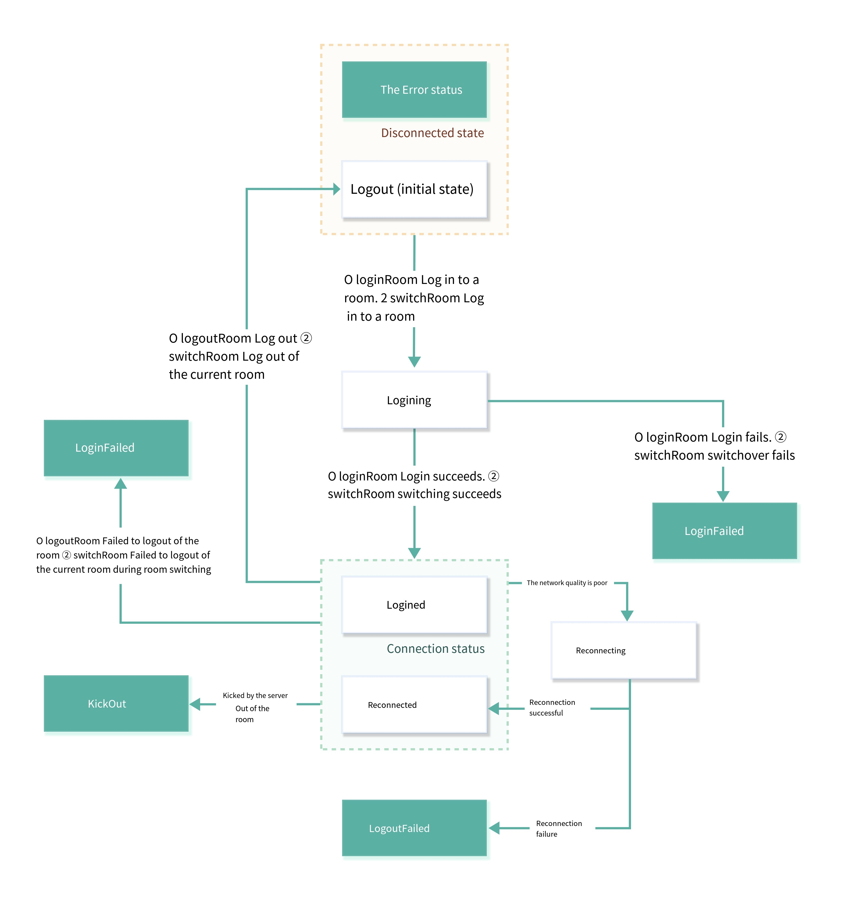

# Room connection status description

When users use the ZEGO Express SDK for audio and video calls or live broadcasts, they need to join the room before they can receive callback notifications such as stream addition/deletion, user entry and exit from other users in the same room. Therefore, the connection status of the user in the room determines whether the user can use the audio and video services normally.

This article mainly introduces how to judge the user's connection status in the room, and the conversion process of each connection status.

# Monitor room connection status

Users can monitor their connection status in this room in real time by listening to the onRoomStateChanged callback. When the user's connection status changes, the SDK will trigger this callback, and specify the current connection status and related error codes in the callback. If the room connection is interrupted due to poor network quality, the SDK will automatically retry.

## Room status description



The connection status of the room will be converted into each other, and developers can judge various situations through reason, and deal with the corresponding logic in combination with errorCode when necessary.

| State | Meaning | Common events that trigger entry into this state |
| ----------------------------------------- | -----------------------------------------|-----------------------------------------|
| ZegoRoomStateChangedReasonLogining | Logging into room. When calling [loginRoom] to log in to the room or [switchRoom] to switch to the target room, this state is entered, indicating that a connection to the server is being requested. The application interface is usually displayed through this state. | 1. Call [loginRoom] to log in to the room, it will enter this state first, and the errorCode is 0. 1. When calling [switchRoom] to switch to the target room, the SDK internally requests to log in to the target room, and the errorCode is 0 at this time. |
| ZegoRoomStateChangedReasonLogined | Login to the room succeeded. When the room is successfully logged in or switched, it will enter this state, indicating that the login to the room has been successful, and the user can normally receive the callback notification of additions and deletions of other users and all stream information in the room. | 1. Call [loginRoom] to log in to the room successfully, and the errorCode is 0 at this time. 1. When calling [switchRoom] to switch to the target room, the SDK internal login to the target room is successful, and the errorCode is 0 at this time. |
| ZegoRoomStateChangedReasonLoginFailed | Room login failed. When the room login or room switching fails, enter this state, indicating that the room login or room switching has failed, for example, the AppID or Token is incorrect, etc. | 1. When using the Token authentication function, the incoming Token is wrong, and the errorCode is 1002033. 1. When the login room times out due to network problems, the errorCode is 1002053. 1. When switching to the target room, the SDK Failed to log in to the target room internally, please refer to the above login error description for errorCode. |
| ZegoRoomStateChangedReasonReconnecting | The room connection was temporarily interrupted. If there is an interruption due to poor network quality, the SDK will retry internally. | When the room connection is temporarily interrupted and reconnected due to poor network quality, the errorCode is 1002051. |
| ZegoRoomStateChangedReasonReconnected | Room reconnected successfully. If there is an interruption due to poor network quality, the SDK will retry internally and enter this state after successful reconnection. | When the room connection is temporarily interrupted due to poor network quality, the reconnection succeeds, and the errorCode is 0. |
| ZegoRoomStateChangedReasonReconnectFailed | Room reconnect failed. If there is an interruption due to poor network quality, the SDK will retry internally and enter this state after the reconnection fails. | When the room connection is temporarily interrupted due to poor network quality and the reconnection fails, the errorCode is 1002053. |
| ZegoRoomStateChangedReasonKickOut | Kicked out of the room by the server. For example, if you log in to the room with the same user name in other places and cause the local end to be kicked out of the room, it will enter this state. | 1. The user is kicked out of the room (because the user with the same userID is logged in elsewhere), and the errorCode is 1002050. 1. The user is kicked out of the room (the developer actively calls the background [kick out the room user] (https:/ /doc-zh.zego.im/article/8784) interface), the errorCode is 1002055 at this time. |
| ZegoRoomStateChangedReasonLogout | Logout of the room succeeded. It is in this state by default before logging into the room. It will enter this state after calling [logoutRoom] to successfully log out of the room or [switchRoom] to successfully log out of the current room. | 1. After calling [logoutRoom] to log out of the room successfully, the errorCode is 0. 1. When calling [switchRoom] to switch rooms, the SDK successfully logs out the current room. |
| ZegoRoomStateChangedReasonLogoutFailed | Failed to log out of the room. Enter this state when calling [logoutRoom] fails to log out of the room or [switchRoom] fails to log out of the current room internally. | In a multi-room scenario, when calling [logoutRoom] to log out of a room, the room ID does not exist, and the errorCode is 1002002. |

## Processing of common business events

#### 1. Log in to the room for the first time

When the reason is ZegoRoomStateChangedReasonLogining, it means that the developer is actively logging into the room and is connecting, and the errorCode is 0.

#### 2. The first login to the room is successful

When the reason is ZegoRoomStateChangedReasonLogined, it means that the first login to the room is successful, and the errorCode is 0.

#### 3. Failed to log in to the room for the first time

When the reason is ZegoRoomStateChangedReasonLoginFailed, it means that the first login to the room failed. For details of errorCode, please refer to [Common Error Codes](https://doc-zh.zego.im/article/4377).

#### 4. The room is temporarily disconnected and is being reconnected

When the reason is ZegoRoomStateChangedReasonReconnecting, it means that the room connection is temporarily interrupted, the SDK is reconnecting, and the errorCode is 1002051.

#### 5. After the room is temporarily disconnected, the reconnection is successful

When the reason is ZegoRoomStateChangedReasonReconnected, it means that after the room connection is temporarily interrupted, the SDK reconnects successfully, and the errorCode is 0.

#### 6. After the room is temporarily disconnected, the reconnection fails

When the reason is ZegoRoomStateChangedReasonReconnectFailed, it means that the SDK fails to reconnect after the room connection is temporarily interrupted, and the errorCode is 1002053.

#### 7. Getting kicked out of the room by the server

When the reason is ZegoRoomStateChangedReasonKickOut, it means the user was kicked out of the room.

* The errorCode is 1002050 when kicked because the user with the same userID is logged in elsewhere.
* The errorCode is 1002055 when the developer is kicked out because the developer actively calls the [Kick the room user](https://doc-zh.zego.im/article/8784) interface in the background.

#### 8. Log out of the room successfully

When the reason is ZegoRoomStateChangedReasonLogout, it means the logout is successful.

#### 9. Failed to log out of the room

When the reason is ZegoRoomStateChangedReasonLogoutFailed, it means the logout of the room failed. Only in the multi-room scenario, when the logout room ID does not exist, the error code is 1002002.

Developers can refer to the following codes to handle common business events:

```objectivec
-(void)onRoomStateChanged:(ZegoRoomStateChangedReason)reason errorCode:(int)errorCode extendedData:(NSDictionary *)extendedData roomID:(NSString *)roomID {
if(reason == ZegoRoomStateChangedReasonLogining)
    {
        // logging in
        // On behalf of the developer, actively call the callback in the connection triggered by loginRoom
    }
    else if(reason == ZegoRoomStateChangedReasonLogined)
    {
        // login successful
        // Currently, the developer actively calls loginRoom to trigger the callback of successful login. Here, the business logic of successful login to the room for the first time can be processed, such as pulling the basic information of chat room and live room.
    }
    else if(reason == ZegoRoomStateChangedReasonLoginFailed)
    {
        // Login failed
        if (errorCode == 1002033) {
            //When using the login room authentication function, the incoming token is wrong
        }
    }
    else if(reason == ZegoRoomStateChangedReasonReconnecting)
    {
        // reconnecting
        // Currently it is a callback triggered by SDK disconnection and reconnection successfully. It is recommended to show some reconnection UI here.
    }
    else if(reason == ZegoRoomStateChangedReasonReconnected)
    {
        // reconnect successfully
    }
    else if(reason == ZegoRoomStateChangedReasonReconnectFailed)
    {
        // reconnect failed
        // When the room connection is completely disconnected, the SDK will not reconnect. If the developer needs to log in to the room again, he can actively call the loginRoom interface
        // At this point, you can log out of the room/live room/classroom in the business, or manually call the interface to log in again
    }
    else if(reason == ZegoRoomStateChangedReasonKickOut)
    {
        // kicked out of the room
        if (errorCode == 1002050) {
            // User kicked out of room (due to user with same userID logged in elsewhere)
        }
        else if (errorCode == 1002055) {
            // The user is kicked out of the room (the developer actively calls the kicking interface in the background
        }
    }
    else if(reason == ZegoRoomStateChangedReasonLogout)
    {
        // successfully logged out
        // The developer actively calls logoutRoom to log out of the room
        // Developers can handle the logic of active logout callback here
    }
    else if(reason == ZegoRoomStateChangedReasonLogoutFailed)
    {
        // logout failed
        // logout room ID error
    }
}
```
